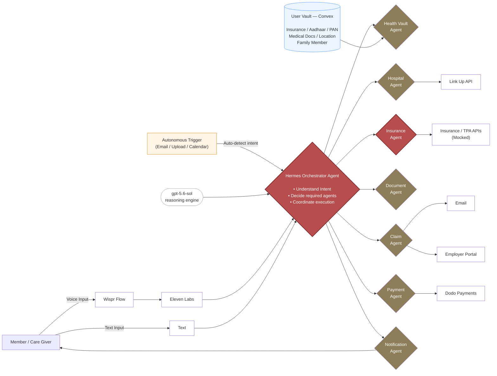

# Astra — Autonomous Healthcare Journey OS

> **Patients recover. Astra handles everything else.**

🎨 **Figma Prototype:** [Astra Healthcare Journey OS](https://www.figma.com/make/fUTUr1kFgBvuPUKWz2KNNb/Astra-Healthcare-Journey-OS?fullscreen=1&t=19xqSuWYOYs0tEZy-1&code-node-id=0-9)

---

## ⚡ Quick Start (Devs)

**Prereqs:** Node 18+, a [Convex](https://convex.dev) account (free), and Python 3.10+ (only for the agents service).

```bash
git clone https://github.com/ZuckyNeeraj/astra.git
cd astra

# 1. Shared DB (Convex) — run from repo root, LEAVE IT RUNNING in its own terminal
npm install
npx convex dev          # first time: log in → "choose an existing project" → astra
                        #   (very first dev only: "create a new project" → astra)
# copies the deployment URL into .env.local automatically

# 2. Frontend — new terminal
cd frontend
npm install
cp .env.example .env.local     # set VITE_CONVEX_URL to the URL Convex printed above
npm run dev                    # → http://localhost:5173

# 3. Agents (Python/FastAPI) — new terminal, optional until backend work starts
cd agents
python3 -m venv .venv && source .venv/bin/activate
pip install -r requirements.txt
cp .env.example .env           # fill in OPENAI / LINKUP / ELEVENLABS / DODO + CONVEX_URL
uvicorn main:app --reload --port 8000   # → http://localhost:8000/docs
```

**Handy Convex commands** (run from repo root, with `convex dev` running):

```bash
npm run db:seed                      # load the demo "Father's Knee Surgery" journey
npx convex dashboard                 # open the visual data browser (add/edit rows in a UI)
npx convex run journeys:listActive   # query from the CLI
```

**Layout:** `frontend/` (React+Vite UI) · `convex/` (shared DB: schema + functions) · `agents/` (Hermes orchestrator).
**Secrets rule:** only `VITE_*` values are safe in the browser — real API keys go in Convex env vars / `agents/.env`, never `VITE_`-prefixed. `.env.local` is git-ignored; commit only `*.env.example`.

> New to the project or the shared-DB flow? See [**Repository & Team Setup**](#repository--team-setup) below for the full walkthrough.

---

## Problem Statement

Healthcare is stressful not only because people are sick, but because they suddenly become **project managers**.

Today, a patient has to coordinate:

- Hospitals
- Doctors
- Insurance companies
- TPAs
- HR
- Documents
- Approvals
- Claims
- Follow-ups
- Medicines

This coordination happens while the patient or their family is already under **emotional and financial stress**.

Current products solve isolated problems:

- Hospital apps
- Insurance apps
- Claim portals
- Appointment apps

**Nobody owns the entire healthcare journey from diagnosis to recovery.**

---

## Why Does This Matter?

India's health insurance ecosystem has become massive, but the experience remains **fragmented**.

**Some numbers:**

- **58 crore** lives were covered under health insurance in FY 2024–25.
- General and health insurers settled **3.26 crore** health insurance claims worth **₹94,248 crore** in FY 2024–25.
- Health insurance premiums exceeded **₹1.17 lakh crore**, making health the largest segment in non-life insurance.
- About **69%** of claims involve TPAs, and **58%** are processed cashlessly, meaning patients often coordinate across multiple organizations.
- Recent surveys report that **40%** of claimants experienced full or partial claim rejections without clear explanations, and **50%** faced discharge delays due to pending cashless approvals.

> The problem isn't the lack of insurance. **It's the lack of coordination.**

---

## Vision

Imagine saying: *"My father needs knee replacement surgery."*

Instead of opening six apps and making twenty phone calls,

**Astra autonomously handles everything.**

---

## Hermes Buildathon — Track & Strategy

Astra is built for the **Hermes Buildathon** (GrowthX). It runs on the **Hermes Agent** (Nous Research) — Hermes is the base harness our end users interact with, driven by **GPT-5.6 Sol**. *No Hermes, no score,* so the orchestration layer literally **is** a Hermes agent.

### Our track: **AI as Agency** (Track 03)

> *"A team of AI agents replaces a full human function. A manager agent plans, specialists execute, handoffs pass work between them, memory persists across tasks, and a control surface lets a non-engineer assign work."*

Astra fits this exactly — the full human function it replaces is the **healthcare care-coordinator / journey project-manager**. The **Hermes Orchestrator** is the manager agent; Hospital, Insurance, Document, Claim, Payment, Notification and Health-Vault agents are the specialists.

**Root parameter (20×, max 80): working product shipping real output.** To score high we must show agents completing a *real* job end-to-end on *real* surfaces (real email, real payment, real DB writes), escalating to a human only by exception. Staged/mock surfaces cap at L3 — so where feasible we use **real** integrations (Convex writes, Dodo checkout, ElevenLabs voice, real email) even though insurer/TPA APIs stay mocked.

### What the rubric rewards (design these in deliberately)

| Parameter | Weight | How Astra earns it |
| --------- | ------ | ------------------ |
| Working product shipping real output | 20× | Full journey brief → hospital found → docs collected → claim filed, on real surfaces |
| Agent org structure | 5× | **Dynamic delegation** — Hermes plans subtasks per request & reviews outputs (not a fixed pipeline) |
| Observability | 7× | A run viewer: pick a journey, see each agent's step, tokens & cost (the AI Activity Dashboard) |
| Evaluation & iteration | 5× | A named eval set of sample journeys; failed runs feed it |
| Handoffs & memory | 2× | Health Vault + journey state persist across agents and tasks (Convex) |
| Cost & latency per task | 1× | Keep a journey step under a few minutes / cents |
| Management UI | 1× | Non-engineer can define/assign a new agent role from the UI |

### Partner Power-ups — go for all six (+25 each = **+150**)

Real use only; a mentor must see each working live.

- ✅ **Wispr Flow** — 500+ words dictated during the event (voice goal input)
- ✅ **ElevenLabs** — voice doing real work (spoken journey updates / notifications)
- ✅ **Convex** — stores real product state / is the main backend
- ✅ **Linkup** — live search doing real work (hospital & cost lookup)
- ✅ **Dodo Payments** — a **live checkout** in the product (deposit / co-pay)
- ✅ **Cloudflare** — hosting / Workers doing real work (live URL)

### Rules that shape the build

- **Fresh build only** — started on the floor today; no pre-existing product or company product.
- **Build on-site**, 8-hour sprint, no remote teammates or code shipped in from outside.
- **Must use Hermes** — as the harness end users interact with (our case) and/or as the coding partner (keep session receipts).
- **Ship to a real URL** a judge can open on their own device, and submit via the day's link. No slides or zip files.
- **Every number is verified live** — the demo is 2 min live demo + 1 min proof (dashboards on screen) + 1 min Q&A.

---

## Proposed Solution

Astra is an **AI-powered Healthcare Journey Operating System**.

**Astra is not a chatbot. It is an autonomous agent that works in the background.**

Most healthcare tools wait for you to open an app and start typing. Astra is the opposite — it **observes, analyzes, and acts on its own**, only pulling the human in when a decision or approval is genuinely needed.

There are two ways Astra kicks off a journey:

### 1. Autonomous Triggers (the core idea)

Astra watches your connected sources — **email, documents, calendar, uploads** — and springs into action without being asked.

> **Example:** You receive an email — *"Your annual full-body health checkup is scheduled."*
>
> Astra's agent **automatically triggers**, reads the email, understands the intent, and starts orchestrating:
> - Checks your insurance policy for preventive-checkup coverage
> - Finds nearby empanelled diagnostic centers
> - Pre-fills and files any required forms
> - Books/blocks the slot and schedules reminders
> - Notifies your family — all **before you even open the app**

Other autonomous triggers: a lab report arriving by email, a doctor's prescription upload, an insurance renewal notice, or a discharge summary — each one wakes the relevant agent and advances the journey.

### 2. Goal Input (when you want to start one)

You can also hand Astra a goal directly, by **voice or text**.

> Example: *"My father needs heart surgery."*

Everything else is orchestrated automatically.

### What Astra plans and executes

- ✅ Understands medical intent
- ✅ Creates treatment journey
- ✅ Estimates costs
- ✅ Finds hospitals
- ✅ Reads insurance policy
- ✅ Verifies cashless eligibility
- ✅ Collects documents
- ✅ Tracks approvals
- ✅ Files claims
- ✅ Schedules follow-ups
- ✅ Notifies family

### The Assistant (one part, not the whole)

A conversational assistant *does* exist — you can ask *"Why was my claim rejected?"* or *"What's the status of dad's surgery?"* and get grounded, cited answers (`journey_ai_chat`). But it is **one surface into the system**, not the system itself. The autonomous agents run whether or not you ever open the chat.

---

## MVP — 8-Hour Hackathon Scope

We will **simulate** insurer, hospital, and TPA APIs.

**Build:**

- Voice input
- Planner Agent
- Hospital Search
- Mock Insurance Policy Reader
- Claim Workflow
- AI Activity Dashboard
- Approval Center
- Journey Timeline

> No real insurer integrations required.

---

## Tech Stack

| Layer          | Technology              |
| -------------- | ----------------------- |
| Agent Runtime  | **Hermes Agent** (Nous Research) — the base harness Astra runs on |
| Reasoning Model| **GPT-5.6 Sol** (OpenAI) driving Hermes |
| Frontend       | React / Next.js, Tailwind CSS |
| Backend        | Python, FastAPI         |
| Database       | Convex                  |
| Voice (out)    | ElevenLabs              |
| Voice (in)     | Wispr Flow              |
| Search         | Linkup API              |
| Payments       | Dodo Payments           |
| Hosting        | Cloudflare (Workers / Pages) |

### Partner Perks & Credits (from the Buildathon)

Every accepted builder gets **$400+** in credits before writing a line of code. These map directly onto Astra's stack, so there's **no new procurement or billing** needed during the sprint:

| Partner           | Perk                                   | How to claim                                                                 | Where it's used in Astra |
| ----------------- | -------------------------------------- | --------------------------------------------------------------------------- | ------------------------ |
| **OpenAI**        | $200 credits + 1 month Codex Pro       | Auto-granted to the **org ID submitted at registration** — nothing to redeem (cannot be issued later). | GPT-5.6 Sol reasoning behind Hermes + every sub-agent |
| **Linkup**        | $50 in credits                         | Sign up → Settings → Add Credits → select $50 → enter code **`HERMES`**       | Hospital / diagnostic-center & cost search |
| **Wispr Flow**    | 3 months free                          | Sign up via [the promo link](http://wisprflow.ai/?promo_code=WISPRXHERMES&months=3) — applies automatically, no code | Voice input / dictation → text before Hermes |
| **ElevenLabs**    | 1 month Creator                        | Join [Discord](https://discord.com/invite/VnBvbbcdEC) → `#coupon-codes` → Start Redemption → select "GrowthX Hackathon" | Voice output — spoken updates & family notifications |
| **Dodo Payments** | Zero fees on first $1,000              | Unique code arrives by email → Settings → [Promotions](https://app.dodopayments.com/settings?tab=promotions) → enter code | Deposits, non-cashless co-pays, cost settlements |
| **Convex**        | (Prize-tier; free tier works for MVP)  | Standard signup                                                             | Primary backend / Health Vault state |
| **Cloudflare**    | (Prize-tier; free tier works for MVP)  | Standard signup                                                             | Hosting, Workers, Pages |

> ⚠️ **OpenAI perk is org-ID gated.** If the OpenAI org ID wasn't submitted at registration, the $200 + Codex Pro **cannot** be issued later — confirm this is sorted before the sprint.

---

## Proposed Implementation

### Database Schema

#### `patient_journey`

| Column Name  | Data Type    | Constraints / Extra                         |
| ------------ | ------------ | ------------------------------------------- |
| id           | UUID         | PK, DEFAULT gen_random_uuid()               |
| patient_id   | UUID         | FK → patient.id, NOT NULL, INDEX            |
| hospital_id  | UUID         | FK → hospital.id, NOT NULL, INDEX           |
| diagnosis    | TEXT         | NULL                                        |
| current_stage| VARCHAR(50)  | NOT NULL, INDEX                             |
| current_step | VARCHAR(100) | NOT NULL                                    |
| status       | VARCHAR(20)  | DEFAULT 'ACTIVE', INDEX                     |
| priority     | VARCHAR(20)  | DEFAULT 'NORMAL'                            |
| started_at   | TIMESTAMP    | DEFAULT NOW()                              |
| completed_at | TIMESTAMP    | NULL                                        |
| created_by   | UUID         | FK → user.id                               |
| created_at   | TIMESTAMP    | DEFAULT NOW()                              |
| updated_at   | TIMESTAMP    | DEFAULT NOW()                              |

#### `journey_stage`

| Column Name  | Data Type    | Constraints / Extra              |
| ------------ | ------------ | -------------------------------- |
| id           | UUID         | PK, DEFAULT gen_random_uuid()    |
| journey_id   | UUID         | FK → patient_journey.id, NOT NULL, INDEX |
| stage_name   | VARCHAR(100) | NOT NULL                         |
| order_number | INT          | NOT NULL                         |
| status       | VARCHAR(20)  | DEFAULT 'NOT_STARTED', INDEX     |
| started_at   | TIMESTAMP    | NULL                             |
| completed_at | TIMESTAMP    | NULL                             |
| created_at   | TIMESTAMP    | DEFAULT NOW()                   |
| updated_at   | TIMESTAMP    | DEFAULT NOW()                   |

#### `journey_task`

| Column Name      | Data Type    | Constraints / Extra              |
| ---------------- | ------------ | -------------------------------- |
| id               | UUID         | PK, DEFAULT gen_random_uuid()    |
| journey_stage_id | UUID         | FK → journey_stage.id, NOT NULL, INDEX |
| title            | VARCHAR(255) | NOT NULL                         |
| description      | TEXT         | NULL                             |
| task_type        | VARCHAR(50)  | NOT NULL, INDEX                  |
| assigned_to      | UUID         | FK → user.id, INDEX             |
| owner_type       | VARCHAR(30)  | NOT NULL                         |
| status           | VARCHAR(20)  | DEFAULT 'TODO', INDEX            |
| due_date         | TIMESTAMP    | NULL, INDEX                      |
| completed_at     | TIMESTAMP    | NULL                             |
| created_at       | TIMESTAMP    | DEFAULT NOW()                   |
| updated_at       | TIMESTAMP    | DEFAULT NOW()                   |

#### `journey_document`

| Column Name         | Data Type    | Constraints / Extra              |
| ------------------- | ------------ | -------------------------------- |
| id                  | UUID         | PK, DEFAULT gen_random_uuid()    |
| journey_id          | UUID         | FK → patient_journey.id, NOT NULL, INDEX |
| task_id             | UUID         | FK → journey_task.id, INDEX     |
| document_type       | VARCHAR(100) | NOT NULL                         |
| file_url            | TEXT         | NOT NULL                         |
| uploaded_by         | UUID         | FK → user.id                    |
| verification_status | VARCHAR(20)  | DEFAULT 'PENDING', INDEX         |
| ocr_status          | VARCHAR(20)  | DEFAULT 'PENDING'                |
| extracted_data      | JSONB        | NULL                             |
| created_at          | TIMESTAMP    | DEFAULT NOW()                   |
| updated_at          | TIMESTAMP    | DEFAULT NOW()                   |

#### `journey_timeline`

| Column Name | Data Type    | Constraints / Extra              |
| ----------- | ------------ | -------------------------------- |
| id          | UUID         | PK, DEFAULT gen_random_uuid()    |
| journey_id  | UUID         | FK → patient_journey.id, NOT NULL, INDEX |
| event_type  | VARCHAR(100) | NOT NULL                         |
| message     | TEXT         | NOT NULL                         |
| actor       | VARCHAR(50)  | NOT NULL                         |
| metadata    | JSONB        | NULL                             |
| created_at  | TIMESTAMP    | DEFAULT NOW(), INDEX             |

#### `journey_recommendation`

| Column Name | Data Type    | Constraints / Extra              |
| ----------- | ------------ | -------------------------------- |
| id          | UUID         | PK, DEFAULT gen_random_uuid()    |
| journey_id  | UUID         | FK → patient_journey.id, NOT NULL, INDEX |
| type        | VARCHAR(50)  | NOT NULL                         |
| title       | VARCHAR(255) | NOT NULL                         |
| description | TEXT         | NULL                             |
| priority    | VARCHAR(20)  | DEFAULT 'MEDIUM'                 |
| status      | VARCHAR(20)  | DEFAULT 'OPEN', INDEX            |
| created_at  | TIMESTAMP    | DEFAULT NOW()                   |
| updated_at  | TIMESTAMP    | DEFAULT NOW()                   |

#### `journey_approval`

| Column Name    | Data Type    | Constraints / Extra              |
| -------------- | ------------ | -------------------------------- |
| id             | UUID         | PK, DEFAULT gen_random_uuid()    |
| journey_id     | UUID         | FK → patient_journey.id, NOT NULL, INDEX |
| approval_type  | VARCHAR(50)  | NOT NULL                         |
| requested_to   | UUID         | FK → organization/user, INDEX   |
| status         | VARCHAR(20)  | DEFAULT 'PENDING', INDEX         |
| requested_at   | TIMESTAMP    | DEFAULT NOW()                   |
| approved_at    | TIMESTAMP    | NULL                             |
| remarks        | TEXT         | NULL                             |
| created_at     | TIMESTAMP    | DEFAULT NOW()                   |

#### `integration_request`

| Column Name      | Data Type    | Constraints / Extra              |
| ---------------- | ------------ | -------------------------------- |
| id               | UUID         | PK, DEFAULT gen_random_uuid()    |
| journey_id       | UUID         | FK → patient_journey.id, NOT NULL, INDEX |
| provider         | VARCHAR(100) | NOT NULL, INDEX                  |
| request_type     | VARCHAR(100) | NOT NULL                         |
| request_payload  | JSONB        | NOT NULL                         |
| response_payload | JSONB        | NULL                             |
| status           | VARCHAR(20)  | DEFAULT 'PENDING', INDEX         |
| retry_count      | INT          | DEFAULT 0                        |
| last_attempt     | TIMESTAMP    | NULL                             |
| created_at       | TIMESTAMP    | DEFAULT NOW()                   |

#### `journey_notification`

| Column Name  | Data Type    | Constraints / Extra              |
| ------------ | ------------ | -------------------------------- |
| id           | UUID         | PK, DEFAULT gen_random_uuid()    |
| journey_id   | UUID         | FK → patient_journey.id, NOT NULL, INDEX |
| recipient    | UUID         | FK → user.id, INDEX             |
| channel      | VARCHAR(20)  | NOT NULL                         |
| title        | VARCHAR(255) | NOT NULL                         |
| message      | TEXT         | NOT NULL                         |
| status       | VARCHAR(20)  | DEFAULT 'PENDING', INDEX         |
| scheduled_at | TIMESTAMP    | NULL, INDEX                      |
| sent_at      | TIMESTAMP    | NULL                             |
| created_at   | TIMESTAMP    | DEFAULT NOW()                   |

#### `journey_ai_chat`

| Column Name | Data Type    | Constraints / Extra              |
| ----------- | ------------ | -------------------------------- |
| id          | UUID         | PK, DEFAULT gen_random_uuid()    |
| journey_id  | UUID         | FK → patient_journey.id, NOT NULL, INDEX |
| user_type   | VARCHAR(20)  | NOT NULL                         |
| question    | TEXT         | NOT NULL                         |
| answer      | TEXT         | NOT NULL                         |
| citations   | JSONB        | NULL                             |
| created_at  | TIMESTAMP    | DEFAULT NOW()                   |

#### `journey_template`

| Column Name | Data Type    | Constraints / Extra              |
| ----------- | ------------ | -------------------------------- |
| id          | UUID         | PK, DEFAULT gen_random_uuid()    |
| name        | VARCHAR(255) | NOT NULL, UNIQUE                 |
| description | TEXT         | NULL                             |
| version     | VARCHAR(20)  | DEFAULT '1.0'                    |
| created_at  | TIMESTAMP    | DEFAULT NOW()                   |

#### `journey_template_stage`

| Column Name  | Data Type    | Constraints / Extra              |
| ------------ | ------------ | -------------------------------- |
| id           | UUID         | PK, DEFAULT gen_random_uuid()    |
| template_id  | UUID         | FK → journey_template.id, NOT NULL, INDEX |
| stage_name   | VARCHAR(100) | NOT NULL                         |
| order_number | INT          | NOT NULL                         |
| created_at   | TIMESTAMP    | DEFAULT NOW()                   |

#### `journey_template_task`

| Column Name      | Data Type    | Constraints / Extra              |
| ---------------- | ------------ | -------------------------------- |
| id               | UUID         | PK, DEFAULT gen_random_uuid()    |
| template_stage_id| UUID         | FK → journey_template_stage.id, NOT NULL, INDEX |
| task_name        | VARCHAR(255) | NOT NULL                         |
| task_type        | VARCHAR(100) | NOT NULL                         |
| is_mandatory     | BOOLEAN      | DEFAULT TRUE                     |
| default_owner    | VARCHAR(50)  | NOT NULL                         |
| created_at       | TIMESTAMP    | DEFAULT NOW()                   |

---

## Architecture — Hermes Multi-Agent Orchestration

At the center is **Hermes**, the orchestrator agent. It understands intent (from voice, text, or an autonomous trigger), decides which specialist agents are needed, and coordinates their execution against the user's **Health Vault**.



**Agents:**

- **Hermes Orchestrator** — the brain; understands intent and routes work to specialists.
- **Health Vault Agent** — reads/writes the user's secure vault (insurance, Aadhaar, PAN, medical docs, family).
- **Hospital Agent** — finds hospitals & diagnostic centers via Linkup.
- **Insurance Agent** — checks policy, cashless eligibility against (mocked) Insurance/TPA APIs.
- **Document Agent** — collects, OCRs, and verifies documents.
- **Claim Agent** — files claims, coordinates with Email / Employer Portal.
- **Payment Agent** — handles deposits and co-pays via Dodo Payments.
- **Notification Agent** — keeps the member and family informed (ElevenLabs voice + text).

---

## Workflow

```
Autonomous Trigger              Explicit Goal
(email / upload / calendar)     (voice via Whispr Flow, or text)
        │                               │
        └───────────────┬───────────────┘
                        ▼
             Hermes Orchestrator  ──►  Understands intent, picks agents
                        │
                        ▼
        Create Patient Journey (from journey_template)
                        │
        ├─► Estimate Costs
        ├─► Find Hospitals (Hospital Agent · Linkup)
        ├─► Read Insurance Policy (Insurance Agent · mock TPA)
        ├─► Verify Cashless Eligibility
        ├─► Collect & Verify Documents (Document Agent · OCR)
        ├─► Track Approvals (Approval Center)
        ├─► File Claims (Claim Agent · Email / Employer Portal)
        ├─► Collect Payments (Payment Agent · Dodo Payments)
        └─► Schedule Follow-ups
                        │
                        ▼
        AI Activity Dashboard + Journey Timeline
                        │
                        ▼
        Notify Family (Notification Agent · ElevenLabs voice + text)
```

---

## Repository & Team Setup

The repo is a monorepo. The **shared database is Convex** — there is no Postgres to
host and no DB container to run. One person creates the Convex project, everyone
else connects to the *same cloud deployment*, so all teammates read/write the same
live data.

```
astra/
├── frontend/     React + Vite UI            → deploys to Cloudflare Pages
├── convex/       shared DB: schema + funcs  → the source of truth for state
├── agents/       Python + FastAPI (Hermes orchestrator + specialist agents)
├── .env.example  every key the project needs (copy → .env.local, fill in)
└── package.json  root: Convex tooling only
```

### 1. Convex — the shared DB (do this first)

```bash
# From the repo root
npm install
npx convex dev          # first run: log in, then "create a new project" → Astra
```

- The **first teammate** creates the project; Convex prints a deployment URL and
  writes `CONVEX_DEPLOYMENT` into `.env.local`.
- **Everyone else**: get invited to that Convex project (Convex dashboard → project
  → invite), then run `npx convex dev` and pick the **existing** deployment — now
  you're all on one shared DB.
- Load the demo data (once): `npm run db:seed`.
- The schema lives in `convex/schema.ts` — edit it and `convex dev` hot-reloads the
  types for everyone.

### 2. Frontend

```bash
cd frontend
npm install
cp .env.example .env.local     # set VITE_CONVEX_URL to the Convex URL from step 1
npm run dev                    # http://localhost:5173
```

### 3. Agents (Hermes orchestration)

```bash
cd agents
python3 -m venv .venv && source .venv/bin/activate
pip install -r requirements.txt
cp .env.example .env           # fill in OPENAI/LINKUP/ELEVENLABS/DODO + CONVEX_URL
uvicorn main:app --reload --port 8000
```

### Secrets — where each key lives

| Key | Lives in | Notes |
| --- | --- | --- |
| `VITE_CONVEX_URL` | `frontend/.env.local` | **Public** — safe to bundle into the browser |
| `OPENAI`, `LINKUP`, `ELEVENLABS`, `DODO` keys | Convex dashboard env vars **and/or** `agents/.env` | **Never** prefix with `VITE_` — that would leak them to the client |

> `.env`, `.env.local`, and `convex/_generated/` are git-ignored. Only `*.env.example`
> files (no real values) are committed. Never commit a real key.

---

## Setup — Getting Hermes Running

Astra runs on the Hermes Agent. Do this **before** the sprint, not during it.

### 1. Install Hermes (Linux / macOS / WSL2 / Termux)

```bash
curl -fsSL https://raw.githubusercontent.com/NousResearch/hermes-agent/main/scripts/install.sh | bash
```

### 2. Point Hermes at a model (we use OpenAI — perk credits already ours)

Grab a key from `platform.openai.com/api-keys` and put it in `~/.hermes/.env`:

```
OPENAI_API_KEY=sk-...
```

Set the provider in `~/.hermes/config.yaml` — note the provider id is **`openai-api`**, not `openai`:

```yaml
model:
  provider: "openai-api"
  default: "gpt-5.6-sol"
```

Or one-line it:

```bash
hermes chat --provider openai-api --model gpt-5.6-sol
```

> Alternatives: **OpenRouter** ($10 credit, same models) or **Nous Portal** ($20/mo managed tool gateway — web search, image gen, TTS, browser automation handled for you). The provider is **not scored**; points come only from the six partner integrations.

### 3. Verify

```bash
hermes status     # shows your provider + model
```

### 4. (Optional) Remote control via Telegram

`hermes gateway setup` → select Telegram → paste bot token (from `@BotFather`) and your numeric user ID (from `@userinfobot`). Then `hermes gateway` and DM the bot. Fallback env in `~/.hermes/.env`:

```
TELEGRAM_BOT_TOKEN=<your-bot-token>
TELEGRAM_ALLOWED_USERS=<your-numeric-user-id>
```

### 5. Using Hermes as your coding partner (carry over your Claude/Codex setup)

Hermes reads your repo's project file in order: `.hermes.md` → `AGENTS.md` → `CLAUDE.md` (first one wins — keep one). Point it at existing skills in `~/.hermes/config.yaml`:

```yaml
skills:
  external_dirs:
    - ~/.claude/skills
```

Global instructions go in `~/.hermes/SOUL.md` (behavior) and `~/.hermes/memories/MEMORY.md` (facts, capped ~2,200 chars). MCP servers move from JSON into an `mcp_servers:` block in `config.yaml`.

---

## Future Roadmap

- Real insurer integrations
- Hospital APIs
- Digital Health Records
- WhatsApp support
- Wearables
- Caregiver mode
- Medicine delivery
- Emergency mode
